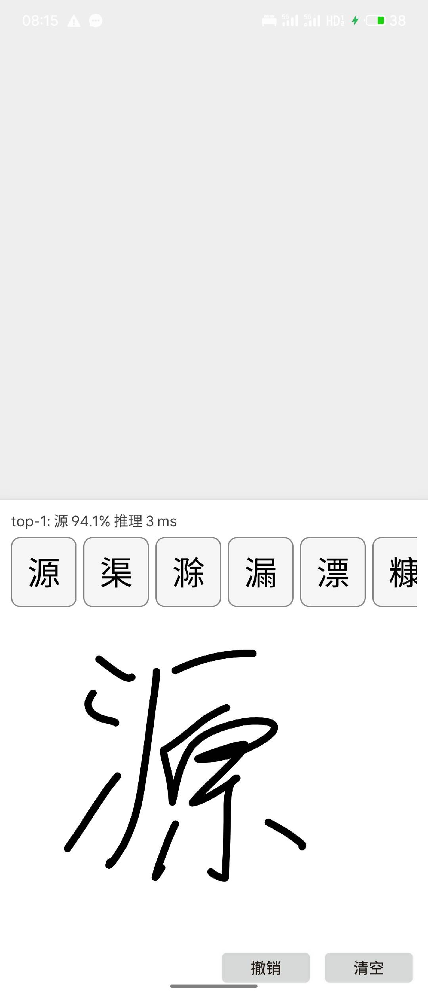
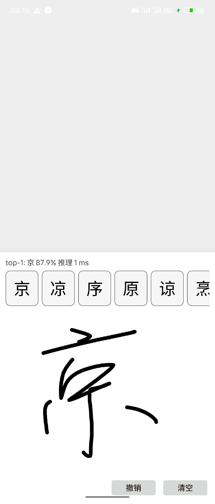

# Handwritten

端到端手写汉字识别：**CASIA HWDB1.1 → PyTorch → NCNN INT8 → Android**。
MobileNetV2 在 3755 类 GB2312 一级字上的 Top-1 为 95.47%，INT8 模型 4.1 MB，
移动端推理约 2–5 ms。

## Android 应用

Android 端支持在画布上手写汉字，并实时显示 top-1 置信度、候选字符和推理耗时。

<p align="center">
  
  
</p>

APK 的构建、安装和模型部署说明见 [`docs/DEPLOY.md`](docs/DEPLOY.md)。
Handwritten 是独立发布的离线手写识别应用；输入法可集成其已验证的模型与预处理，
但不依赖安装本应用。

## 使用

已训练的 PyTorch checkpoint 和 NCNN INT8 模型发布在
[`Ismantic/Handwritten`](https://huggingface.co/Ismantic/Handwritten)。
使用 Demo 不需要下载 CASIA 数据，也不需要重新训练；Makefile 会在首次运行时
把模型下载到 `models/Handwritten/`。

安装桌面推理依赖：

```bash
uv pip install numpy Pillow ncnn
```

识别一张白底黑字图片：

```bash
make -C demo cli IMG=path/to/image.png
```

启动 Tkinter 手写板：

```bash
make -C demo run
```

两个入口默认加载 `models/Handwritten/ncnn/model.ncnn.{param,bin}` 和同目录的
`charset.json`。也可以提前下载，或覆盖 `MODEL_DIR`：

```bash
make -C save download
make -C demo run MODEL_DIR=models/other_model
```

Android APK 的构建与安装见 [`docs/DEPLOY.md`](docs/DEPLOY.md)。

## 代码

```text
data/       原始数据状态、解压；不包含可再分发的数据
prepare/    GNT 解析、字符表、64×64 NumPy 数据集
src/        模型、Dataset、训练、评测、共享 C 预处理
save/       PNNX/NCNN 导出、FP16/INT8 量化、基准
models/     从 Hugging Face 下载的本地模型缓存
demo/       Tkinter 与命令行推理
android/    Java + JNI + NCNN 独立应用
android/runtime/  供 Demo 与下游 Android 应用复用的 HCCR runtime
test/       单元测试、跨实现一致性、指标复现
docs/       训练、部署和设计理由
```

`src/` 不解析 GNT，也不负责模型发布；`prepare/` 只把有许可的本地原始数据转换
成数值输入；Python 和 Android 均编译 `src/cpp/preprocess.c`，避免预处理漂移。

## 训练

环境要求为 Python ≥3.10、PyTorch、C 编译器；Android 另需 JDK 17、SDK 35、
NDK 和 CMake。建议使用独立虚拟环境：

```bash
uv pip install -r requirements.txt
cp local.mk.example local.mk     # 可选：覆盖 PYTHON
make -C data status
```

只使用 CPU 时可先从 PyTorch CPU 源安装，避免下载 CUDA 运行库：

```bash
uv pip install torch torchvision --index-url https://download.pytorch.org/whl/cpu
uv pip install numpy Pillow tqdm matplotlib ncnn pnnx
```

CASIA HWDB1.1 不能随仓库再分发。请从官方渠道申请并把
`HWDB1.1trn_gnt.zip`、`HWDB1.1tst_gnt.zip` 放入 `data/`，随后运行：

```bash
make -C data extract
make -C prepare all
make -C src smoke
```

完整训练：

```bash
make -C src train RUN_DIR=runs/mbv2
```

## 导出

```bash
make -C save all RUN_NAME=mbv2 NAME=mbv2
make -C save export
make -C save verify
make -C save upload
```

`runs/` 保存训练 checkpoint，`save/output/` 保存转换产物，
`save/releases/Handwritten/` 是上传前的自包含发布包。正式发布源在 Hugging
Face，`models/` 只保存下载缓存。

## 验证

```bash
python -m unittest discover -s test -v
HCCR_REPRODUCE=1 python -m unittest test.test_reproduce -v
cd android && ./gradlew testDebugUnitTest assembleDebug
```

指标复现测试默认关闭，因为它需要完整测试集和 checkpoint。修改预处理、模型或
量化时必须同时报告 checkpoint、命令、top-1/top-10、延迟和模型大小。

## 文档

- [`docs/TRAIN.md`](docs/TRAIN.md)：数据准备与训练。
- [`docs/DEPLOY.md`](docs/DEPLOY.md)：NCNN 导出和 Android 构建。
- [`docs/WHY.md`](docs/WHY.md)：关键口径、量化结论与容易静默出错的地方。

Apache-2.0，见 [`LICENSE`](LICENSE)。CASIA 数据遵循其自身许可。
